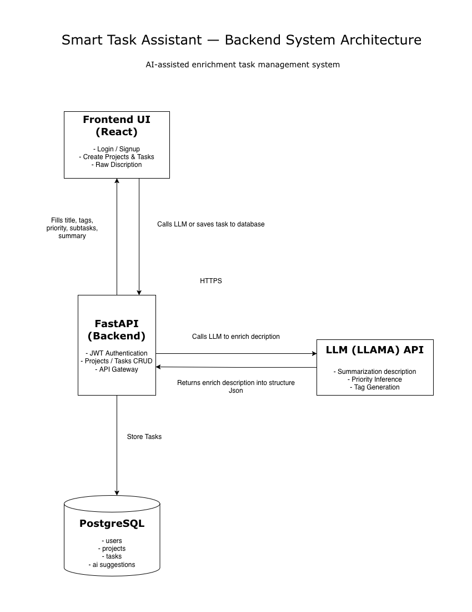

## System Architecture
Smart Task Assistant front/backend system

## Design Decisions
- **Why FastAPI?**

FastAPI was chosen for its async-first architecture, automatic OpenAPI
documentation, and high performance. It enables rapid iteration while remaining
production-ready and easy to scale.

- **Why RabbitMQ + Celery?**

AI-powered task enrichment can take several seconds and should not block user
requests. RabbitMQ and Celery allow long-running jobs to be processed
asynchronously while maintaining reliability, retries, and observability.

- **Why async AI processing?**

Separating AI processing from the request lifecycle keeps API response times low,
improves user experience, and enables horizontal scaling of workers independently
from the API layer.

---
The diagram below illustrates request flow, data persistence, and async task execution.

## Async Workflow
1. The client sends a request to create or enhance a task.
2. FastAPI validates authentication and persists initial task data.
3. A message is published to RabbitMQ for AI processing.
4. Celery workers consume the message and invoke AI services.
5. The processed result is stored back in PostgreSQL.
6. The client retrieves updated task data via polling or refresh.

## Performance & Metrics

## Future Improvements
- Redis caching for frequently accessed tasks and project metadata
- Rate limiting to protect AI endpoints and prevent abuse
- Multi-tenant scaling with per-user quotas and isolated workloads
