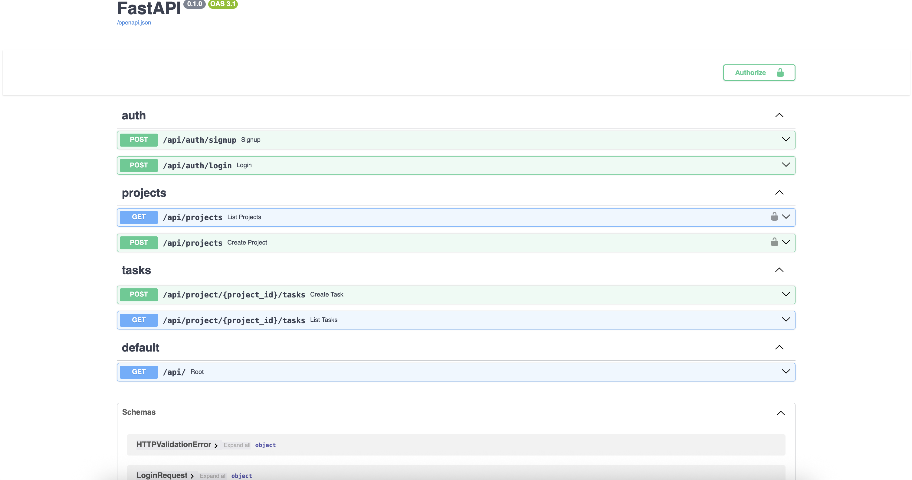

### Why I Built This Project

The Smart Task Assistant was created to demonstrate a production-like backend system capable of:

- Handling task/project CRUD operations with FastAPI and PostgreSQL
- Enriching tasks with AI-powered suggestions using a synchronous LLM workflow
- Designing the backend in a modular way for future asynchronous processing

This project showcases my ability to design and implement scalable, maintainable backend architectures and demonstrates practical experience with modern AI integrations.

## System Architecture
Smart Task Assistant front/backend system

## Design Decisions
- **Why FastAPI?**
FastAPI was chosen for its high performance, automatic OpenAPI documentation, and modular architecture. It enables rapid iteration while remaining production-ready and easy to scale.

- **Why synchronous AI enrichment?**
Currently, task enrichment occurs synchronously to provide immediate feedback to the user. This keeps the workflow simple and responsive while demonstrating reliable LLM integration and structured output parsing.

- **Future async improvements**
The backend is designed to support asynchronous processing (e.g., RabbitMQ + Celery) for long-running AI tasks or notifications. This separation would allow horizontal scaling of workers independently from the API layer without changing the core architecture.

---
The diagram below illustrates request flow, data persistence, and async task execution.

## Synchronous Workflow
1. The client sends a request to create or enhance a task.
2. FastAPI validates authentication and persists the initial task data.
3. The LLM (LLaMA) enriches the task synchronously with enhanced description, subtasks, priority, and acceptance criteria.
4. The processed result is stored back in PostgreSQL.
5. The client receives the enriched task immediately in the response.

## Performance & Metrics

### Scalability

The Smart Task Assistant is designed with scalability in mind:

- Modular backend design separates API, domain logic, and AI enrichment, enabling future horizontal scaling.
- System is designed to support asynchronous processing (RabbitMQ + Celery) for large-scale AI enrichment if needed.

## Future Improvements
- Add RabbitMQ + Celery for background task enrichment and email/slack notifications.
- Redis caching for frequently accessed tasks and project metadata.
- Rate limiting to protect AI endpoints and prevent abuse.
- Multi-tenant scaling with per-user quotas and isolated workloads.
